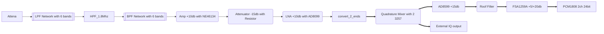
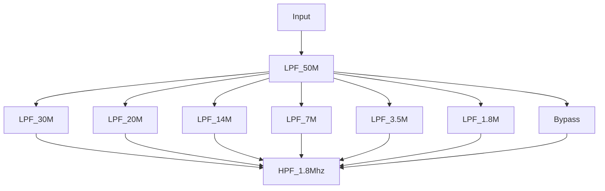

---

layout: post
title:  "Elecraft KX3 deep dive"
date:   2020-11-10 22:14:00
categories: [ SDR ]
featured: true

---

*他山之石，可以攻玉*

This serial of blogs are analyzing the details of the schematic of KX3 for my personal study purpose.

## Worth Note Designs

1. Use I2CEN, SPIEN to reduce the digital noise

There are couple of digit chips are not on the main MCU board. The connections to those chips are controlled via EN signal.

2. Use two FST3257 chip to mix the IQ signal on RX

Although FST3257 has enough channels to mix two channels, still use two seperate chips. This should help the isolation between I,Q channels and eventually improve SNR.

3. Use multi stages of amplifiers

There are 4 stages of amplifiers in RX stage. Each one has its own DC offset voltage. 

4. 

## RX analog path overview

Receiver is getting the signal from antenna and feed into a Elliptic LPF network. The LPF network is using 7 relays to control the network. The first stage of input is a 6m band LPF (50Mhz), the second stage is selecting one of 6 LPFs.

### Low Pass Filter Network and High Pass Filter

6m (50M) Band is 2 holes filter, and other LPFs are 2 - 3 holes. High Pass filter is one hole filter.

The relays are controlled via a GPIO extension chip.

### Band Pass Filter Network

## Preamplifier

This amplifier is first amplifier. It uses the DC offset of 1.6V and gives about 10db (based on 2SC4536 or NE46134).

This amplifier is optional controlled by the signal of PREAMP_ON. The control is done via the RF switch chip.

## Clock Generation for ADC/DAC

## Common used chips

### RF Switch

[PE4283](https://www.psemi.com/pdf/datasheets/pe4283ds.pdf)

0 - 4G RF switch. there are many other replaced components. This chip is only 1 channel switch. And it is used a lot in the KX3 device.

This chip is discontinued and replaced by PE4259ds.

### Mixer

[SN74CBT3257](https://www.ti.com/support-quality/quality-policies-procedures/product-life-cycle.html)

2:1 4-channels switch chip used as the mixer of RX. Interestingly, KX3 uses two chips for two channels. It should help the isolation level between IQ channels.

[SN74CBT3253](https://www.ti.com/product/SN74CBT3253)
4:1 2-channels switch chip used as the mixer of TX. This time, only one chip is used to mix up both IQ channels.

### ADC / DAC

[PCM1808](https://www.ti.com/lit/ds/symlink/pcm1808.pdf)
Single Ended 24bit, 96khz, 2-channels ADC. This chip is used as the ADC for RX.

[PCM1773](https://www.ti.com/lit/gpn/pcm1773)
98dB SNR Low-Power Stereo DAC with line-out. This chip is used as the DAC for TX.

[TLV320AIC3105](https://www.ti.com/product/TLV320AIC3105)
Low-Power Stereo CODEC with 6 Inputs, 6 Outputs, HP Amp and Enhanced Digital Effects. This chip is used to interface with microphone, speaker to handle the audio data.

### Clock Generator

[Si570](https://www.silabs.com/documents/public/data-sheets/si570.pdf)
10 MHZ TO 1.4 GHZ I2C PROGRAMMABLE XO/VCXO. This chip generate the clocks for ADC and DAC. Since this chip cannot output the clock slower than 10Mhz, there is a divider of 8 is used to generate the slow clocks. One 7474 counter chip is used to divide the input clk by 8.

### Temperature

[LM20](https://www.ti.com/lit/ds/symlink/lm20.pdf)
LM20 2.4-V, 10-µA, SC70, DSBGA Temperature Sensor. This chip is used to sense the tempature of Si570 and the PA BJT.

### I/O extension chip

[MCP23S17](https://ww1.microchip.com/downloads/en/devicedoc/20001952c.pdf)
SPI bus to support up to 16 GPIOs.

### Amplifiers

[AD8099](https://www.analog.com/media/en/technical-documentation/data-sheets/AD8099.pdf)
Single, Ultralow Distortion, High Speed,0.95 nV/√Hz Voltage Noise Op Amp. This chip is used to do amplify in RF.

[AD8599](https://www.analog.com/media/en/technical-documentation/data-sheets/AD8597_8599.pdf)
Dual, Ultralow Distortion, Ultralow Noise Op Amps. This chip is used to amplify both IQ channels in IF.

[OPA2209](https://www.ti.com/lit/ds/symlink/opa2209.pdf)
Dual 2.2-nV/√Hz, Low-Power, 36-V Operational Amplifier. This amplifier can operate up to 18Mhz. It used as the amplify in IF for both IQ channels.

[ADA4860-1](https://www.analog.com/media/en/technical-documentation/data-sheets/ADA4860-1.pdf)
High Speed, Low Cost, Op Amp. Used as the amplifier of RF in TX.

[SGA7489](https://media.digikey.com/pdf/Data%20Sheets/Sirenza%20Microdevices/SGA-7489(Z)_Datasheet.pdf)
Dual, High performance SiGe HBT, MMIC Amplifier, up to 3Ghz. Use as the driver for power amplifier.

### Power Amplifier (PA)

RD15HVF1RF Mos FET to drive 10W power amplify.

### Digital POT

[MCP4661](https://www.microchip.com/wwwproducts/en/MCP4661)
8-Bit Dual Digital POT with NVM and I2C to control the output power of PA.