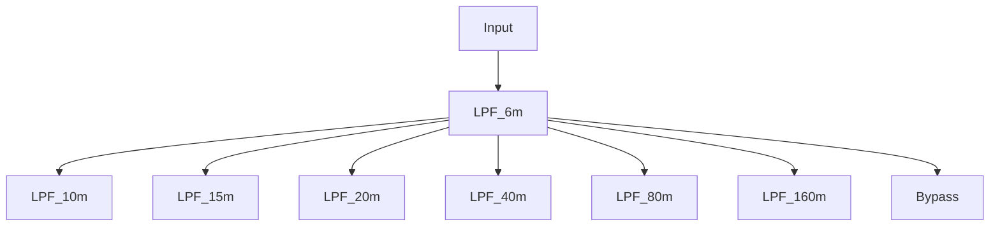

## Elecraft KX3 deep dive

This serial of blogs are analyzing the details of the schematic of KX3 for my personal study purpose.

### RX analog path overview

Receiver is getting the signal from antenna and feed into a Elliptic LPF network. The LPF network is using 7 relays to control the network. The first stage of input is a 6m band LPF (50Mhz), the second stage is selecting one of 6 LPFs.

6m Band is 2 holes filter, and other LPFs are 3 - 5 holes.

The relays are controlled via a GPIO extension chip MCP23S17.

### Clock Generation for ADC/DAC

