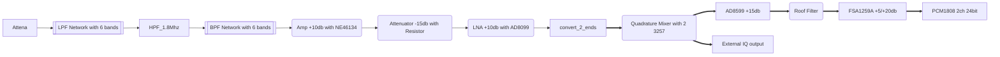
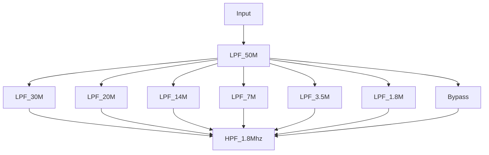

---

layout: post
title:  "Elecraft KX3 deep dive"
date:   2020-11-10 22:14:00
categories: [ SDR ]
featured: true

---

## Elecraft KX3 deep dive 他山之石，可以攻玉

This serial of blogs are analyzing the details of the schematic of KX3 for my personal study purpose.

### RX analog path overview

Receiver is getting the signal from antenna and feed into a Elliptic LPF network. The LPF network is using 7 relays to control the network. The first stage of input is a 6m band LPF (50Mhz), the second stage is selecting one of 6 LPFs.

#### Low Pass Filter Network and High Pass Filter

6m Band is 2 holes filter, and other LPFs are 2 - 3 holes. High Pass filter is one hole.

The relays are controlled via a GPIO extension chip MCP23S17.

#### Band Pass Filter Network

### Clock Generation for ADC/DAC

