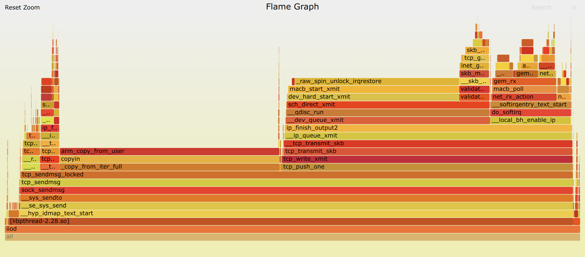

## What limits the network performance of PlutoSDR

I did some performance testing after I successfully enable the 1000M Ethernet on Zynq7010. The Ethernet is connected as eth0:

```
2: eth0: <BROADCAST,MULTICAST,UP,LOWER_UP> mtu 1500 qdisc pfifo_fast qlen 1000
    link/ether 00:0a:35:00:01:22 brd ff:ff:ff:ff:ff:ff
    inet 169.254.2.35/16 brd 169.254.255.255 scope link eth0:avahi
       valid_lft forever preferred_lft forever
```

I directly connect the PlutoSDR with my PC with a cable, without a switch/hub in between. So I can make sure the performance will not get impacted by the switch.

Here is what I got, which is discouraging.

```
$ iio_readdev -n 169.254.2.35 -b 100000 cf-ad9361-lpc voltage2 | pv > /dev/null
 428MiB 0:00:10 [41.4MiB/s] [                                   <=>            ]
```

Compare to the [performance](https://wiki.analog.com/university/tools/pluto/devs/performance) over USB or network over USB, this is definitely faster. However I think this is not good considering we are using a 1000M Ethernet.

'top' command shows us something interesting:

```
Mem: 160556K used, 349120K free, 80K shrd, 0K buff, 146380K cached
CPU:   1% usr  42% sys   0% nic  43% idle   0% io   0% irq  13% sirq
Load average: 0.91 0.51 0.21 5/63 20330
  PID  PPID USER     STAT   VSZ %VSZ %CPU COMMAND
19838   941 root     S    49840  10%  47% /usr/sbin/iiod -D -n 3 -F /dev/iio_ffs
    9     2 root     SW       0   0%   0% [ksoftirqd/0]
20178 19575 root     R     2692   1%   0% top
19570   937 root     S     2608   1%   0% /usr/sbin/dropbear -R
  922     1 root     S     2564   1%   0% /bin/sh /sbin/update.sh
   21     2 root     IW       0   0%   0% [kworker/u4:1-ev]
  929     1 avahi    S     3252   1%   0% avahi-daemon: running [pluto.local]
```

Clearly, CPU is the bottleneck. The above result is what I already enabled 2 cores. So the issue should be in the kernel somewhere as most of the time is spend in the kernel.

So I decided to get more details on what time is spending inside the Linux Kernel. 'perf' is the command I am using to collect the information. Half of the time is spending in copy the data from userland to kernel when trying to send. And another 1/3 time is spending in a spinlock.



Enough for today. I will do more investigation later this week.
